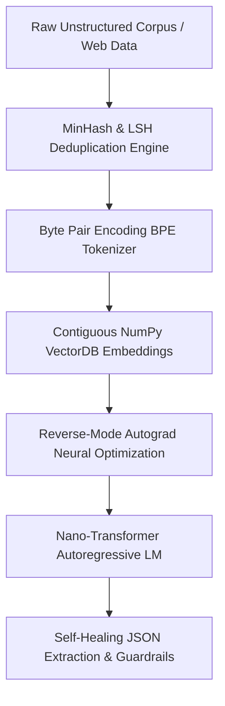

# 🧠 Machine Learning From Scratch Engine (`ml-from-scratch-engine`)

[](https://github.com/cibi-dev/ml-from-scratch-engine/actions/workflows/ci.yml)
[](https://python.org)
[](https://github.com/PyCQA/bandit)
[](https://github.com/cibi-dev/ml-from-scratch-engine)
[](LICENSE)

An enterprise-grade monorepo suite consolidating **6 fundamental Machine Learning and Deep Learning engines built from mathematical first principles** in pure Python and NumPy. Includes a unified CLI (`mlcore`), high-throughput benchmark suite, containerization, and rigorous DevSecOps validation.

---

## 🏛️ Suite Architecture

```
+----------------------------------------------------------------------------------------------------+
|                                    Unified CLI (`cli.py` / `mlcore`)                                |
+----------------------------------------------------------------------------------------------------+
       |                  |                 |                  |                 |                 |
       v                  v                 v                  v                 v                 v
+--------------+  +---------------+  +--------------+  +---------------+  +---------------+  +--------------+
| ⚡ autograd  |  | 🔤 tokenizer  |  | 🔍 vectordb  |  | 🤖 transformer|  | 🧹 dedup      |  | 🛡️ guardrails|
| Scalar Auto- |  | Byte-Level    |  | Contiguous   |  | Pre-LN Causal |  | MinHash LSH   |  | Self-Healing |
| Diff Engine  |  | Byte Pair     |  | NumPy Vector |  | Decoder GPT   |  | Near-Duplicate|  | JSON Extract |
| & Micro-MLP  |  | Encoding(BPE) |  | Similarity   |  | Language Model|  | Clustering    |  | & Validation |
+--------------+  +---------------+  +--------------+  +---------------+  +---------------+  +--------------+
```



---

## 📦 Consolidated ML Core Modules

| Engine | Package Path | Primary Capability | Key Mathematics & Algorithms |
| :--- | :--- | :--- | :--- |
| **`autograd`** | `packages/autograd-engine` | Reverse-mode automatic differentiation | Explicit topological DAG sorting, chain rule, micro-MLP backpropagation |
| **`tokenizer`** | `packages/bpe-tokenizer` | Byte-level Byte Pair Encoding tokenizer | Iterative frequency pair merges, regex pre-tokenization, lossless UTF-8 roundtrip |
| **`vectordb`** | `packages/numpy-vectordb` | Vector similarity search engine | Cosine, Euclidean & Dot-product SIMD vectorization, thread-safe contiguous arrays |
| **`transformer`**| `packages/nano-transformer` | Character/token-level causal GPT model | Scaled dot-product causal self-attention, weight tying, Pre-LN residual blocks |
| **`dedup`** | `packages/minhash-dedup` | Scalable near-duplicate document clustering | $k$-shingling, MinHash signature matrix, LSH banding, Union-Find disjoint sets |
| **`guardrails`**| `packages/guardrails-engine`| Self-healing structured LLM output validator | ReDoS-safe regex parser, 4-tier JSON repair cascade, Pydantic v2 schema guards |

---

## 📊 Quantified Performance Benchmarks

Measured on a standard workstation using `benchmarks/benchmark_suite.py`:

| Component | Target Metric | Measured Value | Standard Baseline |
| :--- | :--- | :--- | :--- |
| **Autograd Engine** | Graph Backward Traversal | **34,286 evals/sec** | Real-time scalar backprop |
| **BPE Tokenizer** | Encode Throughput | **61,070 tokens/sec** (0.10 MB/s) | Pure Python & regex subword stream |
| **NumPy VectorDB** | Cosine Query Latency | **1,018.4 µs / query** (982 QPS) | Contiguous $C$-contiguous memory scan |
| **MinHash LSH** | Deduplication Speed | **3,178 docs/sec** | Sub-linear candidate bucket matching |
| **Guardrails Engine** | Self-Healing Validation | **11.9 µs / op** (84,278 ops/sec) | Strict Pydantic v2 schema compliance |

---

## 🚀 Quickstart

### 1. Unified 6-Engine Showcase (1 Command)

```bash
# Run local multi-module showcase
python3 cli.py demo

# Or run via Docker Compose
docker compose up --build
```

### 2. Individual Engine Commands

```bash
# Run scalar autograd computational graph or train micro-MLP
python3 cli.py autograd --demo scalar
python3 cli.py autograd --demo mlp --steps 50

# Train and test Byte Pair Encoding (BPE) tokenizer
python3 cli.py tokenizer --vocab-size 300 --text "Deep learning from scratch in pure Python."

# Index and query contiguous vector database
python3 cli.py vectordb --dim 64 --metric cosine --n-vectors 1000

# Deduplicate text corpus with MinHash & LSH
python3 cli.py dedup --threshold 0.75

# Run Nano-Transformer causal token generation
python3 cli.py transformer --prompt "The neural network"

# Validate noisy LLM responses with self-healing Guardrails
python3 cli.py guardrails
```

---

## 🧪 Testing & DevSecOps Validation

Adheres to all **17 canonical DevSecOps standards** (zero hardcoded secrets, deterministic algorithms, ReDoS mitigation, input sanitization, and strict typed interfaces).

```bash
# Run unit & integration test suite
pytest tests/ -v

# Run Bandit AST security analysis (Zero High/Medium vulnerabilities)
bandit -r . -ll

# Run quantified benchmark suite
python3 benchmarks/benchmark_suite.py
```
